  

  
  
  
  
  
  

# 🌐 Awesome Blockchain Node Infrastructure

> 🚀 **Curated Directory of Top Web3 SaaS RPC Gateways, Managed Node Providers & Open-Source Node Clients**  
> *Empowering Web3 Developers, Node Operators, and Infrastructure Architects across Ethereum, Bitcoin, Solana, Cosmos, L2s & DePIN Networks.*

---

## 📌 Ecosystem Overview & Key Features

This repository tracks production-grade **SaaS platforms** and **open-source client implementations** powering modern **Blockchain Node Infrastructure**. These solutions provide high-throughput RPC endpoints (JSON-RPC, WebSockets, gRPC), automated validator deployment, archive data retrieval, and decentralized physical infrastructure (DePIN) access.

*   ⚡ **RPC Access & APIs**: Dedicated and shared node endpoints supporting Ethereum, Solana, Bitcoin, Polygon, Optimism, Arbitrum, Base, and 80+ networks.
*   🛡️ **Enterprise Resilience**: SLA-backed node fleets, load-balancing RPC aggregators, and SOC 2 compliant node management platforms.
*   🔓 **Open-Source Client Diversity**: Execution and consensus client software (Geth, Reth, Erigon, Besu, Nethermind, Prysm, Lighthouse, Firedancer, Bitcoin Core) for self-hosted vendor-independent deployments.

---

## 📑 Table of Contents

- [☁️ SaaS & Hosted Node Infrastructure Platforms](#️-saas--hosted-node-infrastructure-platforms)
- [⚡ Open-Source Node Clients & Repositories](#-open-source-node-clients--repositories)
- [🛠️ Architecture & Setup Frameworks](#️-architecture--setup-frameworks)
- [🤝 How to Contribute](#-how-to-contribute)
- [⚖️ Disclaimer & Security Notice](#️-disclaimer--security-notice)
- [💖 Support & Community](#-support--community)
- [📈 Star History](#-star-history)

---

## ☁️ SaaS & Hosted Node Infrastructure Platforms

> 📊 **Market Overview & Structure**: The global Blockchain Node Infrastructure market is estimated at **$2.5B–$4.0B in 2026** and is projected to reach **$10B+ by 2030** driven by multi-chain scaling, Layer-2/Layer-3 rollups, and institutional Web3 adoption. The sector is **moderately fragmented with a tiered oligopoly structure**: market leaders (*Alchemy, Infura, Blockdaemon, QuickNode*) hold significant market share for developer RPC traffic, while decentralized protocol networks (*Ankr, Lava, Pokt*) and specialized niche providers offer competitive alternatives for enterprise and multi-chain workloads.

The table below lists leading SaaS node providers sorted by **Company Size / Valuation** (descending):

| Platform | Description | Company Size / Valuation | Starting Price | Free Tier Limit |
| :--- | :--- | :--- | :--- | :--- |
| 🧪 **[Alchemy](https://www.alchemy.com/)** | Web3 developer platform providing high-scale RPC access, enhanced APIs, Notify webhooks, and multi-chain developer suite. | **$10.2 Billion Valuation** (Series D, $545M+ raised) | $49/month (Growth Plan) or $0.525 / 1M CUs | 30M Compute Units (CUs)/month (300 CUPs) |
| 🦊 **[Infura](https://www.infura.io/)** | Consensys-backed RPC provider serving as MetaMask's default gateway. Supports 20+ major blockchains. | **$7.0 Billion Valuation** (Consensys Parent Series D) | $50/month (Developer Plan) | 3M credits/day (~90M credits/month, 1 API Key) |
| 🔐 **[Blockdaemon](https://www.blockdaemon.com/)** | Enterprise-grade node management, institutional staking, and white-label blockchain infrastructure with strict SLAs. | **$3.25 Billion Valuation** (Series C, $400M+ raised) | ~$0.0000425 per CU ($42.50/1M CUs) auto-scaling | 3M Compute Units (CUs)/month (5 RPS, 1 Test Key) |
| ⚡ **[QuickNode](https://www.quicknode.com/)** | Multi-chain infrastructure supporting 80+ networks with 99.99% uptime, Streams, Webhooks, and IPFS endpoints. | **$800 Million Valuation** (Series B, $60M+ raised) | $49/month (Build Plan) | 10M API Credits/month (15 RPS) |
| ⚓ **[Ankr](https://www.ankr.com/)** | Decentralized Physical Infrastructure Network (DePIN) operating a global RPC node fleet for high-scale applications. | **~$250 Million FDV** (Public DePIN Token / ANKR) | $10 for 100M credits (Pay-As-You-Go) | 200M API credits/month (30 RPS) on Freemium tier |
| 🌋 **[Lava Network](https://www.lavanet.xyz/)** | Decentralized RPC aggregator routing traffic to node providers via AI-driven load balancing and quality-of-service scoring. | **~$100 Million+ Valuation** ($15M+ Seed/Private raised) | Protocol pool funding / 50,000 LAVA validator stake | Free public RPC access via incentivized pools (dynamic QoS rate limits) |
| 🥞 **[Chainstack](https://chainstack.com/)** | Multi-chain infrastructure platform supporting 70+ protocols, featuring Hybrid Cloud options for private AWS/GCP nodes. | **~$50M–$100M Est. Valuation** ($10M+ raised) | $49/month (Growth Plan) | 3M Request Units (RUs)/month (25 RPS, 1 node) |
| 🔮 **[Pokt Network](https://www.pokt.network/)** | Decentralized infrastructure network utilizing independent node runners to service RPC relays. | **~$50M–$80M FDV** (Public POKT Protocol Token) | Staking model (~1 POKT/relay tier) / Gateway fees | 1M relays/day (~30M relays/month via public gateways) |
| 🧱 **[GetBlock](https://getblock.io/)** | Web3 RPC node service providing shared and dedicated endpoints for 50+ blockchains via JSON-RPC & WebSockets. | **~$20M–$50M Est. Valuation** (Private / Bootstrapped) | $49/month ($39/month billed annually) | 50,000 Compute Units (CUs)/day (~1.5M CUs/month, 20 RPS) |
| 🛰️ **[NOWNodes](https://nownodes.io/)** | Reliable node provider offering shared and dedicated RPC nodes for 120+ blockchain networks. | **~$10M–$20M Est. Valuation** (Private Node Operator) | ~€20/month (~$22/month, Pro Plan) | 100,000 requests/month (Start Plan, 5 selected nodes) |

---

## ⚡ Open-Source Node Clients & Repositories

> 🔓 Below is a list of top open-source blockchain node clients, consensus engines, and validator tools, sorted by **GitHub Star Count** (descending). Each star badge links directly to the stargazers page of the respective repository.

*   🪙 **[Bitcoin Core](https://github.com/bitcoin/bitcoin)**   
    *The reference implementation of Bitcoin.* Full node software providing complete block validation, consensus enforcement, and built-in wallet engine.

*   💎 **[Geth (go-ethereum)](https://github.com/ethereum/go-ethereum)**   
    *Official Go implementation of Ethereum.* The battle-tested execution client powering the majority of Ethereum mainnet full nodes and custom RPC clients.

*   ⚡ **[Solana Validator Client](https://github.com/solana-labs/solana)**   
    *Solana reference node implementation in Rust.* Powers high-throughput transaction processing, proof-of-history consensus, and RPC nodes on Solana.

*   💧 **[Sui](https://github.com/MystenLabs/sui)**   
    *Sui Layer 1 blockchain full node software.* Built in Rust with an object-centric data model, Move execution engine, and high-concurrency consensus.

*   ⚛️ **[Cosmos SDK](https://github.com/cosmos/cosmos-sdk)**   
    *Framework for building application-specific blockchains.* Modular Go framework used to launch full node networks across the Interchain ecosystem.

*   ⚙️ **[btcd](https://github.com/btcsuite/btcd)**   
    *Go-based Bitcoin full node implementation.* Maintained by btcsuite, implementing full Bitcoin consensus rules without wallet overhead.

*   🌐 **[Aptos Core](https://github.com/aptos-labs/aptos-core)**   
    *Aptos Layer 1 blockchain core repository.* Implements AptosBFT consensus, Move VM execution, and high-performance validator/full node services.

*   🦀 **[Reth](https://github.com/paradigmxyz/reth)**   
    *Modular Rust Ethereum execution layer client.* Engineered by Paradigm for ultra-high throughput, fast sync times, and modular component reuse.

*   🦄 **[Prysm](https://github.com/prysmaticlabs/prysm)**   
    *Go implementation of Ethereum Proof-of-Stake.* Provides production-ready Beacon Node and Validator client functionality for Ethereum staking.

*   🚀 **[Erigon](https://github.com/erigontech/erigon)**   
    *High-efficiency Ethereum execution client.* Built for speed and storage optimization, widely recognized for high-performance Ethereum archive node syncing.

*   💡 **[Lighthouse](https://github.com/sigp/lighthouse)**   
    *Ethereum consensus client written in Rust.* Developed by Sigma Prime with heavy emphasis on speed, security, and low memory consumption.

*   🔺 **[Avalanche Go](https://github.com/ava-labs/avalanchego)**   
    *Go implementation of Avalanche node architecture.* Reference client for running primary network validators, C-Chain execution, and custom Subnets.

*   ☕ **[Besu](https://github.com/hyperledger/besu)**   
    *Enterprise Java Ethereum client under Hyperledger.* Apache 2.0 licensed, supporting both public mainnet and permissioned private networks.

*   🔷 **[Nethermind](https://github.com/NethermindEth/nethermind)**   
    *High-performance C# .NET Ethereum execution client.* Offers advanced enterprise features, fast sync capabilities, and active protocol updates.

*   🔥 **[Firedancer](https://github.com/firedancer-io/firedancer)**   
    *C-based high-performance Solana validator client.* Developed by Jump Crypto to maximize transaction throughput and provide vital client diversity to Solana.

*   🛡️ **[Teku](https://github.com/Consensys/teku)**   
    *Enterprise Java Ethereum Consensus Client.* Built by Consensys for institutional stakers, providing REST APIs, multi-validator management, and metrics.

*   ☄️ **[CometBFT](https://github.com/cometbft/cometbft)**   
    *Byzantine Fault Tolerant state engine.* Successor to Tendermint Core, providing consensus and networking for Cosmos app-chains.

*   ☁️ **[Nimbus](https://github.com/status-im/nimbus-eth2)**   
    *Resource-efficient Ethereum consensus client in Nim.* Tailored for lightweight infrastructure, embedded hardware, and resource-constrained environments.

*   ⚡ **[Sig](https://github.com/Syndica/sig)**   
    *Zig-based Solana validator client.* Maintained by Syndica, offering low-level performance and language diversity for Solana node operators.

*   🛠️ **[Sedge](https://github.com/NethermindEth/sedge)**   
    *Automated Ethereum validator deployment tool.* Generates custom Docker Compose configurations for execution clients, consensus clients, and MEV-Boost.

---

## 🛠️ Architecture & Setup Frameworks

When deploying production node infrastructure, consider combining components based on your workload requirement:
*   **Ethereum Execution & Consensus**: Pair an execution client (**Geth**, **Reth**, or **Erigon**) with a consensus client (**Prysm**, **Lighthouse**, or **Teku**) using engine API authentication.
*   **Automated Validator Deployment**: Use **Sedge** to orchestrate execution, consensus, validator, and MEV-Boost containers with production-tested settings.
*   **Decentralized Gateway & RPC Routing**: Deploy decentralized gateway tooling (e.g. **PATH**) to load balance traffic across self-hosted and third-party node providers with fallback failover.

---

## 🤝 How to Contribute

Contributions are welcome! To contribute to this curated list:
1. Fork this repository.
2. Add or update entries in `README.md` maintaining table/bullet formats and alphabetical/sorted order where applicable.
3. Include factual descriptions, starting pricing tiers, free tier limits, and valid repository links.
4. Submit a Pull Request with a clear summary of changes.

---

## ⚖️ Disclaimer & Security Notice

- This directory is a **community-curated list** provided for educational and research purposes.
- Running production-grade node infrastructure requires operational expertise in network peering, NVMe storage maintenance, rate limiting, and security hardening.
- Relying exclusively on third-party SaaS RPC providers introduces single-point-of-failure dependencies. Mission-critical Web3 applications should implement multi-provider fallbacks or hybrid self-hosted node backups.

---

## 💖 Support & Community

Thank you for exploring **Awesome Blockchain Node Infrastructure**! If you find this curated list valuable for your Web3 development or infrastructure operations, please consider supporting the project:

*   ⭐ **Star the repo**: Click the star button at the top right to increase visibility.
*   🍴 **Fork & Share**: Spread the word with fellow Web3 developers, DevOps engineers, and node operators.
*   ☕ **Sponsor / Buy Me a Coffee**: Support ongoing updates and maintenance via [GitHub Sponsors](https://github.com/sponsors/ishandutta2007).

  

---

## 📈 Star History

---

  <b>Maintained with ❤️ for the Web3 Developer &amp; Node Infrastructure Community.</b>

